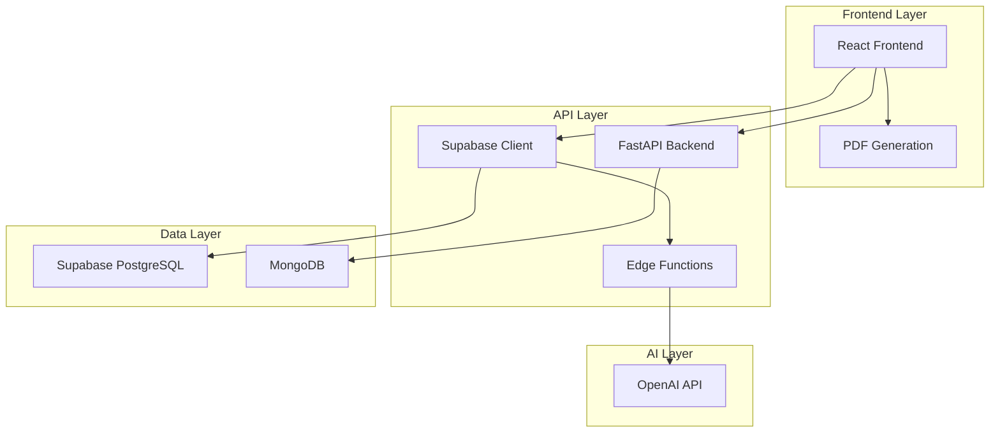
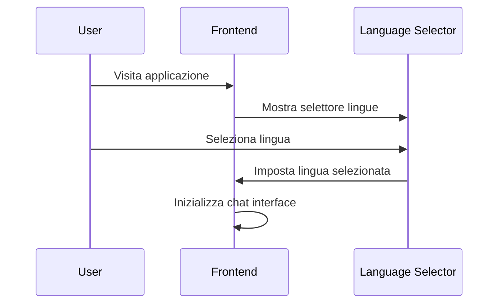
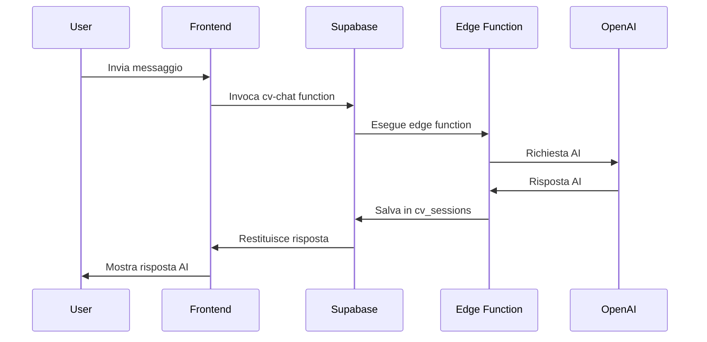
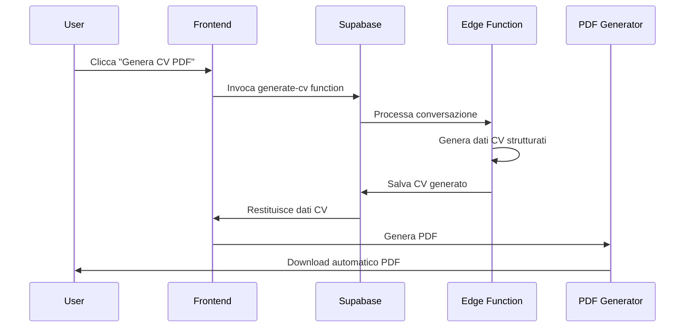

# CV Assistenza Italia 🇮🇹

Una piattaforma intelligente che aiuta i lavoratori stranieri a creare CV professionali per il mercato del lavoro italiano nel settore domestico.


## 📋 Panoramica

CV Assistenza Italia è un'applicazione web avanzata che utilizza l'intelligenza artificiale per assistere i lavoratori stranieri nella creazione di curriculum vitae professionali specificamente adattati per il mercato del lavoro italiano nel settore domestico.

L'applicazione offre un'interfaccia conversazionale multilingue che guida gli utenti attraverso il processo di creazione del CV, utilizzando OpenAI GPT-4o-mini per fornire assistenza intelligente e culturalmente appropriata.

## ✨ Caratteristiche Principali

### 🌍 Supporto Multilingue
- **8 lingue supportate**: Italiano, Inglese, Spagnolo, Francese, Arabo, Rumeno, Polacco, Ucraino
- Interface utente localizzata con nomi nativi delle lingue
- Chat AI che comunica nella lingua dell'utente ma genera CV in italiano

### 🤖 Assistente AI Intelligente
- Conversazioni guidate per raccogliere informazioni professionali
- Adattamento automatico delle esperienze estere al contesto italiano
- Focus su posizioni nel settore domestico: badante, collaboratore domestico, baby-sitter, giardiniere, autista, cuoco

### 📄 Generazione CV Professionale
- Conversione automatica delle conversazioni in CV strutturati
- Formato ottimizzato per il mercato del lavoro italiano
- Esportazione PDF professionale con layout elegante
- Terminologia appropriata per il settore domestico

### 💼 Design Professionale
- Interfaccia utente moderna e responsive
- Tema personalizzato con gradients e ombre eleganti
- Componenti UI basati su Radix/ShadCN
- Design ottimizzato per mobile e desktop

## 🏗️ Architettura Tecnica

### Stack Tecnologico

#### Frontend
```
React 18.3.1 + TypeScript
├── Vite (Build Tool)
├── Tailwind CSS (Styling)
├── Radix UI Components (UI Library)
├── React Router DOM (Routing)
├── TanStack Query (State Management)
├── jsPDF (PDF Generation)
└── React Hook Form (Form Management)
```

#### Backend
```
FastAPI + Python
├── Motor (MongoDB Async Driver)
├── Pydantic (Data Validation)
├── Python-dotenv (Environment Variables)
├── CORS Middleware
└── Uvicorn (ASGI Server)
```

#### Database & Services
```
Supabase PostgreSQL
├── cv_sessions (Chat History Storage)
├── Edge Functions (AI Processing)
└── Row Level Security

MongoDB
├── status_checks (API Monitoring)
└── Future Collections
```

#### AI Integration
```
OpenAI GPT-4o-mini
├── Conversational CV Building
├── Multi-language Support
├── Italian Market Adaptation
└── Structured Data Generation
```

### Diagramma dell'Architettura



## 🚀 Installazione e Setup

### Prerequisiti
- Node.js 18+
- Python 3.8+
- MongoDB
- Account Supabase
- Chiave API OpenAI

### 1. Clonazione del Repository
```bash
git clone <repository-url>
cd cv-assistenza-italia
```

### 2. Setup Frontend
```bash
cd frontend
yarn install
```

### 3. Setup Backend
```bash
cd backend
pip install -r requirements.txt
```

### 4. Configurazione Environment Variables

#### Frontend (.env)
```env
VITE_SUPABASE_PROJECT_ID="your-project-id"
VITE_SUPABASE_PUBLISHABLE_KEY="your-publishable-key"
VITE_SUPABASE_URL="https://your-project.supabase.co"
REACT_APP_BACKEND_URL="http://localhost:8001"
WDS_SOCKET_PORT=443
```

#### Backend (.env)
```env
MONGO_URL="mongodb://localhost:27017"
DB_NAME="cv_assistenza_db"
CORS_ORIGINS="*"
```

#### Supabase Edge Functions
```env
API_KEY="your-openai-api-key"
```

### 5. Database Setup

#### MongoDB
```bash
# Avvia MongoDB localmente
mongod --dbpath /path/to/your/db
```

#### Supabase
```bash
# Applica le migrations
supabase db push

# Deploy edge functions
supabase functions deploy cv-chat
supabase functions deploy generate-cv
```

### 6. Avvio dell'Applicazione

#### Backend
```bash
cd backend
uvicorn server:app --host 0.0.0.0 --port 8001 --reload
```

#### Frontend
```bash
cd frontend
yarn dev
```

L'applicazione sarà disponibile su `http://localhost:3000`

## 📁 Struttura del Progetto

```
cv-assistenza-italia/
├── frontend/                     # React Frontend
│   ├── src/
│   │   ├── components/           # Componenti React
│   │   │   ├── ui/              # Componenti UI base
│   │   │   ├── ChatInterface.tsx # Interface chat principale
│   │   │   └── LanguageSelector.tsx # Selettore lingue
│   │   ├── pages/               # Pagine dell'app
│   │   │   ├── Index.tsx        # Homepage
│   │   │   └── NotFound.tsx     # 404 Page
│   │   ├── integrations/        # Integrazioni esterne
│   │   │   └── supabase/        # Client Supabase
│   │   ├── hooks/               # Custom React Hooks
│   │   ├── lib/                 # Utility functions
│   │   └── assets/              # Risorse statiche
│   ├── supabase/                # Configurazione Supabase
│   │   ├── functions/           # Edge Functions
│   │   │   ├── cv-chat/         # AI Chat Function
│   │   │   └── generate-cv/     # CV Generation Function
│   │   └── migrations/          # Database Migrations
│   ├── public/                  # File pubblici
│   ├── package.json             # Dipendenze frontend
│   ├── tailwind.config.ts       # Configurazione Tailwind
│   └── vite.config.ts           # Configurazione Vite
├── backend/                      # FastAPI Backend
│   ├── server.py                # Server principale
│   ├── requirements.txt         # Dipendenze Python
│   └── .env                     # Variabili ambiente backend
├── tests/                       # Test suite
├── test_result.md              # Risultati testing
└── README.md                   # Questa documentazione
```

## 🔄 Flusso dell'Applicazione

### 1. Selezione Lingua


### 2. Conversazione CV


### 3. Generazione PDF


## 🔌 API Documentation

### FastAPI Endpoints

#### Status Check
```http
POST /api/status
Content-Type: application/json

{
  "client_name": "string"
}
```

#### Get Status Checks
```http
GET /api/status
```

### Supabase Edge Functions

#### cv-chat
Gestisce le conversazioni AI per la creazione del CV.

**Endpoint**: `https://your-project.supabase.co/functions/v1/cv-chat`

**Parametri**:
```json
{
  "message": "Messaggio dell'utente",
  "sessionId": "UUID della sessione (opzionale)",
  "language": "Lingua dell'utente"
}
```

**Risposta**:
```json
{
  "response": "Risposta dell'AI",
  "sessionId": "UUID della sessione"
}
```

#### generate-cv
Genera i dati strutturati del CV dalla conversazione.

**Endpoint**: `https://your-project.supabase.co/functions/v1/generate-cv`

**Parametri**:
```json
{
  "sessionId": "UUID della sessione"
}
```

**Risposta**:
```json
{
  "success": true,
  "cv": {
    "personalInfo": {...},
    "professionalSummary": "...",
    "workExperience": [...],
    "skills": [...],
    "languages": [...],
    "education": [...],
    "references": "..."
  }
}
```

## 🗄️ Schema Database

### Supabase PostgreSQL

#### cv_sessions
```sql
CREATE TABLE public.cv_sessions (
  id UUID NOT NULL DEFAULT gen_random_uuid() PRIMARY KEY,
  user_language TEXT NOT NULL,
  chat_history JSONB DEFAULT '[]'::jsonb,
  generated_cv JSONB,
  created_at TIMESTAMP WITH TIME ZONE NOT NULL DEFAULT now(),
  updated_at TIMESTAMP WITH TIME ZONE NOT NULL DEFAULT now()
);
```

**Campi**:
- `id`: Identificatore univoco della sessione
- `user_language`: Lingua selezionata dall'utente
- `chat_history`: Cronologia completa della conversazione
- `generated_cv`: Dati CV strutturati generati dall'AI
- `created_at`: Timestamp creazione
- `updated_at`: Timestamp ultimo aggiornamento

### MongoDB

#### status_checks
```javascript
{
  id: "string",           // UUID
  client_name: "string",  // Nome client
  timestamp: Date         // Timestamp del check
}
```

## 🎨 Design System

### Colori
```css
:root {
  --primary: 214 95% 35%;     /* Blu professionale */
  --accent: 142 76% 36%;      /* Verde accento */
  --background: 210 40% 98%;  /* Sfondo chiaro */
  --foreground: 222.2 84% 4.9%; /* Testo scuro */
}
```

### Gradienti Personalizzati
```css
--gradient-primary: linear-gradient(135deg, hsl(214 95% 35%), hsl(142 76% 36%));
--gradient-hero: linear-gradient(135deg, hsl(214 95% 35%) 0%, hsl(214 95% 45%) 50%, hsl(142 76% 36%) 100%);
```

### Ombre
```css
--shadow-elegant: 0 10px 30px -10px hsl(214 95% 35% / 0.3);
--shadow-glow: 0 0 40px hsl(214 95% 35% / 0.2);
```

## 🧪 Testing

### Test Protocol
Il file `test_result.md` contiene il protocollo completo per il testing dell'applicazione.

### Esecuzione Test Backend
```bash
cd backend
pytest
```

### Esecuzione Test Frontend
```bash
cd frontend
yarn test
```

## 🚀 Deployment

### Frontend (Vercel/Netlify)
```bash
cd frontend
yarn build
# Deploy della cartella build/
```

### Backend (Railway/Heroku)
```bash
cd backend
# Configura variabili ambiente
# Deploy con provider scelto
```

### Supabase Edge Functions
```bash
supabase functions deploy cv-chat
supabase functions deploy generate-cv
```

## 🔒 Sicurezza

### Implementazioni di Sicurezza
- **CORS**: Configurazione appropriata per domini autorizzati
- **Environment Variables**: Tutte le chiavi API sono protette
- **Row Level Security**: Implementato su Supabase
- **Input Validation**: Validazione Pydantic nel backend
- **Rate Limiting**: Implementato nelle edge functions

### Considerazioni Privacy
- I dati delle conversazioni sono criptati
- Non vengono memorizzati dati personali sensibili permanentemente
- Conformità GDPR per utenti europei

## 📊 Monitoraggio

### Metriche Disponibili
- Numero di sessioni create
- Lingue più utilizzate
- Tassi di completamento CV
- Performance delle edge functions
- Utilizzo API OpenAI

### Logging
- Supabase: Log delle edge functions
- FastAPI: Log delle richieste API
- Frontend: Error tracking e analytics

## 🤝 Contribuire

### Setup Sviluppo
1. Fork del repository
2. Creazione branch feature (`git checkout -b feature/AmazingFeature`)
3. Commit delle modifiche (`git commit -m 'Add some AmazingFeature'`)
4. Push al branch (`git push origin feature/AmazingFeature`)
5. Apertura Pull Request

### Linee Guida
- Seguire le convenzioni TypeScript/Python esistenti
- Aggiungere test per nuove funzionalità
- Documentare le modifiche alle API
- Rispettare il design system esistente

## 📝 Licenza

Questo progetto è sotto licenza MIT. Vedi il file `LICENSE` per dettagli.

## 👥 Team

- **Frontend Development**: React + TypeScript + Tailwind
- **Backend Development**: FastAPI + Python
- **AI Integration**: OpenAI GPT-4o-mini
- **Database**: MongoDB + Supabase PostgreSQL
- **Design**: Custom Design System

## 📞 Supporto

Per supporto o domande:
- Aprire un issue su GitHub
- Contattare il team di sviluppo
- Documentazione API disponibile in `/docs` quando il backend è in esecuzione

---

**CV Assistenza Italia** - Aiutando i lavoratori stranieri a integrarsi nel mercato del lavoro italiano con tecnologia all'avanguardia. 🇮🇹✨
